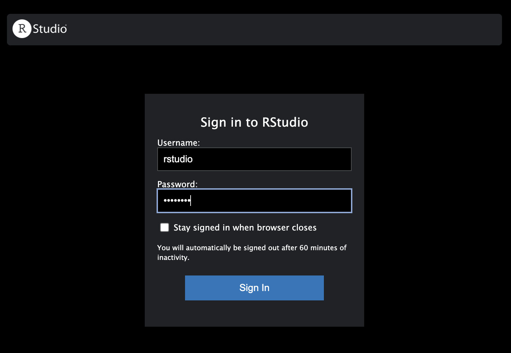
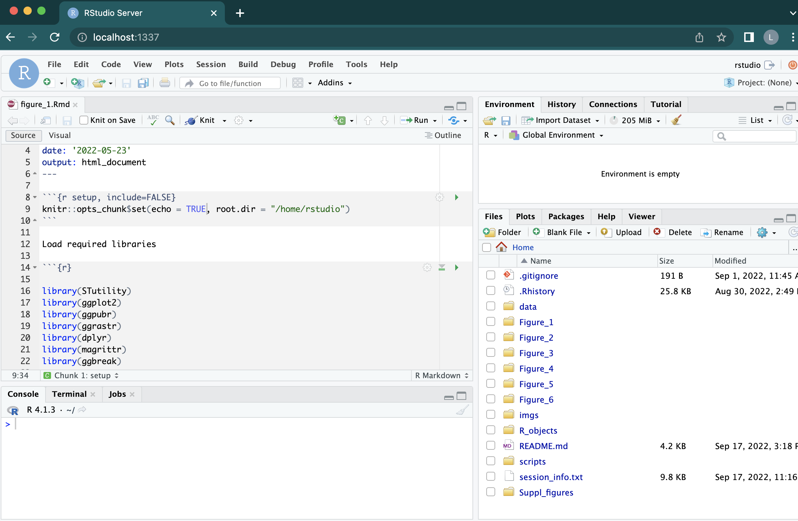

# RRST

## Installation guide - docker 

The docker installation procedure should take less than 15 minutes.

First, make sure that docker is installed on your system. You can find instructions on how to 
install docker [here](https://docs.docker.com/get-docker/). To make sure that the installation 
was successful, open a terminal window and enter:

````
docker ps
````

Clone, you need to clone the github repo:

````
git clone https://github.com/ludvigla/RRST
````

Once the RRST GitHub repo has been downloaded, we can navigate into the newly created folder.

```
cd RRST
````

Now we can generate a container from the `ludlar/rrst` image. This image contains an environment 
with an installation of R and all R packages necessary to run the analyses.

Note that you need to be in the correct folder (i.e. the RRST folder cloned from GitHub). You can change 
`--memory` flag as you see fit, but the code has only been tested with 16GiB of RAM.
You can provide your own password for the RStudio server by replacing `YOURPASSWORD`, for example 
`-e PASSWORD=12345678`. 

Now run the code below (don't forget to replace `YOURPASSWORD`) in the terminal:

````
sudo docker run -d -p 1337:8787 --name RRST -e PASSWORD=YOURPASWORD --memory=16g --mount type=bind,source="$(pwd)",target=/home/rstudio -e ROOT=TRUE ludlar/rrst:latest
````

If you run the code with sudo, you will need to enter your computer password; however, 
it might work well without sudo.

When the `docker run` command is finished, you  can check that the container is running by typing:

````
docker container ls -a
````

Now you can go open a browser (e.g. Chrome) and enter: `localhost:1337` in the address bar. 


This should take you to a login page for an RStudio server where you can enter the user name and your password to login.
Please follow the instruction below (Instruction for use) more more information on how to get started with 
the analysis.



* user name: rstudio
* password: `YOURPASSWORD` 

When you have logged in, you should see something like this:



## Docker trouble shooting

You can start and stop the container by running the following commands from the terminal:

````
docker start RRST
docker stop RRST
````

If you run out of memory in the container, check if you can allocate more with 
`docker run --memory=<SOME VALUE>`. 

You might also want to increase the memory limit in docker. If you run `docker info` you can check how much memory is
available to docker, e.g. "Total memory: 8GiB". If you have more resources available on your system, you can increase 
this number. If you are using the Docker desktop app, open it and go to Preferences -> Resources and increase the memory. 
The docker memory limit puts a limitation on the memory available to the container. 
For example, if you try to set `--memory=16g` when the the docker memory limit is 8GiB, you will end up with 8GiB. 

You can get more info about how to manage resources [here](https://docs.docker.com/config/containers/resource_constraints/)
on the docker website.

## Instructions for use - running analyses

Together, all analyses should take less than an hour to run on a laptop with specs comparable to
those specified under System requirements below.

When you have opened the rstudio server, you should see one folder for each main figue in the 
file viewer pane (bottom right). Inside each of these folders, there is an `.Rmd` notebook
with instructions that you can run to reproduce the analyses and generate plots used 
in the manuscript. 

The data needed to run the analyses is stored at Mendeley Data. Instructions on how to 
download this data can be found in the beginning of each `.Rmd` notebook. 

Supplementary figures are produced in the same `.Rmd` notebooks. For example, supplementary
figures related to Figure 1 can be produced in the `figure_1.Rmd` notebook.

All main figure plots exported in the notebooks are available in the `plots/` sub folders inside 
each figure folder. Supplementary figures are located in the `Suppl_figures/folder`. The expected 
output (plots) from the notebooks should be comparable to these exported figures and the figures 
in the manuscript.

## System requirements

The code has been tested on a Macbook Pro (2017) with the specs below:

	* Processor : 3.1 GHz Quad-Core Intel Core i7
	* Memory : 16 GB 2133 MHz LPDDR3
	* Graphics : Intel HD Graphics 630 1536 MB

## Software dependencies

You can find details about the R environment used in the `session_info.txt` file. We recommend 
using the docker image to run the analyses in a reproducible R environment. Using more recent 
installations of certain R packages may lead to slightly different results, in particular 
for analyses that use functions from the R packages `Seurat` and `sctransform`.
